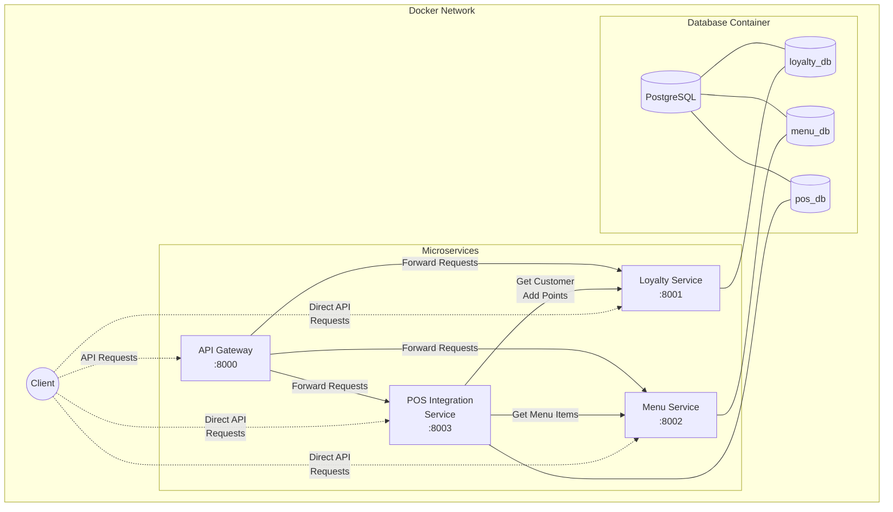

# Café Docker - Microservices Demo Project

This is a demonstration project that explores different approaches to containerizing and orchestrating microservices. The project simulates a café management system with multiple interconnected services, showcasing various Docker and container orchestration techniques.

## Project Overview

This project demonstrates different approaches to building and deploying microservices using containers. Each approach is contained in its own folder to illustrate various containerization strategies and orchestration methods.

### Current Approaches

- **`1-build-with-compose/`** - Basic Docker Compose approach with multi-container orchestration

Each approach demonstrates the same café management system but uses different containerization and deployment strategies.

## Approach 1: Build with Docker Compose

The `1-build-with-compose/` folder contains the basic Docker Compose approach for orchestrating microservices.

### Services Architecture

All approaches implement the same microservices architecture with four main services:

1. **API Gateway Service** (Port 8000)
   - Central entry point for all client requests
   - Routes requests to appropriate microservices
   - Provides a unified API interface to clients

2. **Loyalty Card Service** (Port 8001)
   - Manages customer profiles
   - Tracks loyalty points
   - Allows redeeming points for discounts

3. **Menu Service** (Port 8002)
   - Provides information about available menu items
   - Contains item details (name, description, price)

4. **POS (Point of Sale) Integration Service** (Port 8003)
   - Handles transactions
   - Communicates with both Loyalty and Menu services
   - Applies loyalty points to orders

Each service has its own:
- Containerized environment with specific dependencies
- Independent API endpoints
- Logical database schema within the shared PostgreSQL instance
- Clear responsibilities within the system

## Prerequisites

Before starting, ensure you have the following installed on your system:
- Docker (20.10.x or newer)
- Docker Compose (2.x or newer)

You can verify your installation with:
```bash
docker --version
docker-compose --version
```

## Getting Started

### Choose an Approach

Navigate to the approach you want to explore:

```bash
cd 1-build-with-compose
```

### Clone the Repository
```bash
git clone <repository-url>
cd cafe-docker
```

### Start the Application (Docker Compose Approach)
From the `1-build-with-compose/` directory, run:
```bash
cd 1-build-with-compose
docker-compose up
```

This will:
1. Build all service images if they don't already exist
2. Create containers for each service and their databases
3. Set up the shared network
4. Start all services and make their APIs accessible

To run in detached mode (in the background):
```bash
docker-compose up -d
```

### View Service Logs
To see the logs from all services:
```bash
docker-compose logs
```

For logs from a specific service:
```bash
docker-compose logs loyalty-service
docker-compose logs menu-service
docker-compose logs pos-service
```

### Stop the Application
To stop all running containers:
```bash
docker-compose down
```

To stop and remove all containers, networks, and volumes:
```bash
docker-compose down -v
```

## API Endpoints

### API Gateway (http://localhost:8000)
- `GET /` - Gateway welcome message and service availability
- All endpoints below are accessible through the gateway

### Loyalty Card Service (http://localhost:8001)
- `GET /` - Service welcome message
- `POST /customers` - Create a new customer
- `GET /customers/{customer_id}` - Get customer details
- `GET /customers/{customer_id}/points` - Check loyalty points
- `POST /customers/{customer_id}/points` - Add/subtract loyalty points

### Menu Service (http://localhost:8002)
- `GET /` - Service welcome message
- `GET /menu` - Get all menu items
- `GET /menu/{item_id}` - Get specific menu item details

### POS Service (http://localhost:8003)
- `GET /` - Service welcome message
- `POST /transactions` - Create a new transaction
- `GET /transactions/{transaction_id}` - Get transaction details
- `POST /transactions/{transaction_id}/apply_loyalty` - Apply loyalty points to transaction

## Sample Usage Flow

Here's a typical workflow to test the system:

1. **Create a customer**
```bash
# Using the API Gateway:
curl -X POST http://localhost:8000/customers \
  -H "Content-Type: application/json" \
  -d '{"name": "John Doe", "email": "john@example.com"}'

# Or directly using the Loyalty Service:
curl -X POST http://localhost:8001/customers \
  -H "Content-Type: application/json" \
  -d '{"name": "John Doe", "email": "john@example.com"}'
```

2. **Check menu items**
```bash
# Using the API Gateway:
curl http://localhost:8000/menu

# Or directly using the Menu Service:
curl http://localhost:8002/menu
```

3. **Create a transaction** (replace customer_id and item_id with actual values)
```bash
# Using the API Gateway:
curl -X POST http://localhost:8000/transactions \
  -H "Content-Type: application/json" \
  -d '{
    "customer_id": 1,
    "items": [
      {"item_id": 1, "quantity": 2},
      {"item_id": 3, "quantity": 1}
    ]
  }'

# Or directly using the POS Service:
curl -X POST http://localhost:8003/transactions \
  -H "Content-Type: application/json" \
  -d '{
    "customer_id": 1,
    "items": [
      {"item_id": 1, "quantity": 2},
      {"item_id": 3, "quantity": 1}
    ]
  }'
```

4. **Apply loyalty points** (replace with actual transaction_id)
```bash
# Using the API Gateway:
curl -X POST http://localhost:8000/transactions/1/apply_loyalty \
  -H "Content-Type: application/json" \
  -d '{"points_to_use": 10}'

# Or directly using the POS Service:
curl -X POST http://localhost:8003/transactions/1/apply_loyalty \
  -H "Content-Type: application/json" \
  -d '{"points_to_use": 10}'
```

## Docker Concepts Demonstrated

This project showcases several important containerization concepts across different approaches:

### Docker Compose Approach (`1-build-with-compose/`)

1. **Multi-container applications**: Running multiple services together
2. **Service discovery**: Services can call each other by service name
3. **Environment variables**: Configuring services through environment variables
4. **Volume management**: Persisting database data across container restarts
5. **Network configuration**: Services communicate over a shared network
6. **Dependency management**: Services wait for dependencies before starting
7. **Port mapping**: Exposing internal service ports to the host machine

## Project Structure

```
cafe-docker/
├── README.md                 # Project documentation
├── 1-build-with-compose/     # Docker Compose approach
│   ├── docker-compose.yml   # Main orchestration file
│   ├── api_gateway/          # API Gateway Service
│   │   ├── Dockerfile        # Container configuration
│   │   ├── package.json      # Node.js dependencies
│   │   └── app/
│   │       ├── index.js      # Express.js application code
│   │       └── openapi.yaml  # API specification
│   ├── loyalty_service/      # Loyalty Card Service
│   │   ├── Dockerfile        # Container configuration
│   │   ├── requirements.txt  # Python dependencies
│   │   └── app/
│   │       └── main.py       # FastAPI application code
│   ├── menu_service/         # Menu Service
│   │   ├── Dockerfile
│   │   ├── requirements.txt
│   │   └── app/
│   │       └── main.py
│   └── pos_service/          # POS Integration Service
│       ├── Dockerfile
│       ├── requirements.txt
│       └── app/
│           └── main.py
└── [future approaches will be added here]
```

## Architecture Diagram



## Database Schema

The application uses a single PostgreSQL container (`cafe-db`) that hosts three separate logical databases:

### Loyalty Service DB (loyalty_db)
- `customers` table: Stores customer information
- `loyalty_points` table: Tracks points for each customer

### Menu Service DB (menu_db)
- `menu_items` table: Stores information about available food and drinks

### POS Service DB (pos_db)
- `transactions` table: Records of all transactions with item details

All databases share the same PostgreSQL instance but are logically separated, allowing each service to maintain its own data while simplifying the infrastructure requirements.

## Learning Objectives

Through this project, you should gain an understanding of:

- Different approaches to containerizing microservices
- How containers isolate application code and dependencies
- Various orchestration strategies and their trade-offs
- How microservices communicate with each other
- Basic patterns for service discovery in containerized environments
- Database persistence with Docker volumes
- Environment-based configuration in Docker

## Next Steps

This project will be expanded with additional approaches to demonstrate various containerization and orchestration strategies. Each approach will showcase different tools, patterns, and best practices for deploying microservices in production environments.

## Troubleshooting

### Common Issues

1. **Services can't connect to databases**
   - Check if database containers are running: `docker-compose ps`
   - Verify network connectivity: `docker network inspect cafe-network`

2. **Changes not reflected after rebuild**
   - Force rebuild: `docker-compose up --build`
   - Remove all containers and volumes: `docker-compose down -v` then `docker-compose up`

3. **Port conflicts**
   - Check if ports are already in use: `lsof -i :<port>` (Unix/Mac) or `netstat -ano | findstr :<port>` (Windows)
   - Change the mapped ports in the respective docker-compose.yml file

## Extensions and Challenges

Once you're comfortable with the current approach, try these extensions:

1. Add a web frontend service that connects to the API services
2. Implement authentication and authorization
3. Add automated tests for the services
4. Set up continuous integration/continuous deployment
5. Implement message queuing between services using RabbitMQ or Kafka
6. Compare performance and complexity between different approaches

## Resources for Learning More

- [Docker Documentation](https://docs.docker.com/)
- [Docker Compose Documentation](https://docs.docker.com/compose/)
- [FastAPI Documentation](https://fastapi.tiangolo.com/)
- [Microservices Architecture Pattern](https://microservices.io/patterns/microservices.html)
- [12 Factor App Methodology](https://12factor.net/)